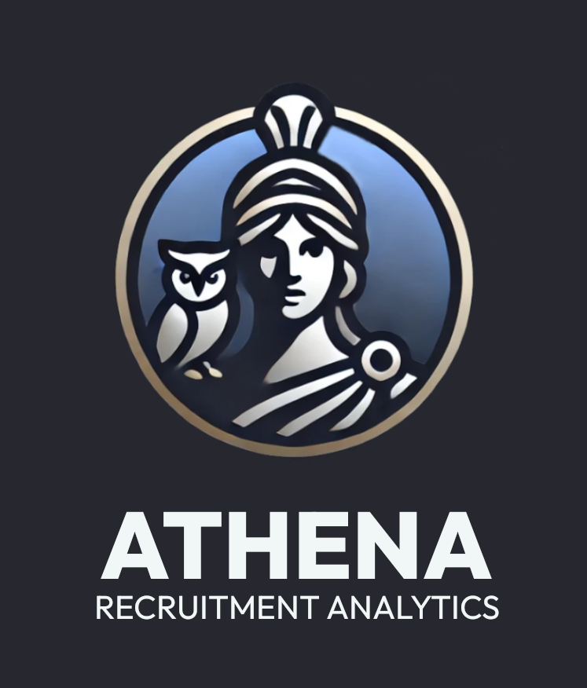

# Welcome to FOX Techniques! 

### 👋🏻 Hi there, 

I'm thrilled to have you here. FOX Techniques is a hub for innovative data services, analytics, and solutions, combining technical expertise with a passion for solving real-world challenges. Whether you're looking for insightful analytics, cutting-edge visualization tools, or cloud-based data solutions, you're in the right place.

## 🛠️ Language & Tools

<!-- |Backend Development||Frontend Development||Data Engineering & Databases|
|---|---|---|---|---|
|   || ||          |

|Cloud & DevOps ||System Adminstration||Visualization & Dashboards|
|----------|---|---|---|---|
| || || |    

|Open-source Contribution||Networking || CodeOps & CI/CD |
|----------|---|---|---|---|
|| ||  |     -->

          

          

## 🚀 Projects

